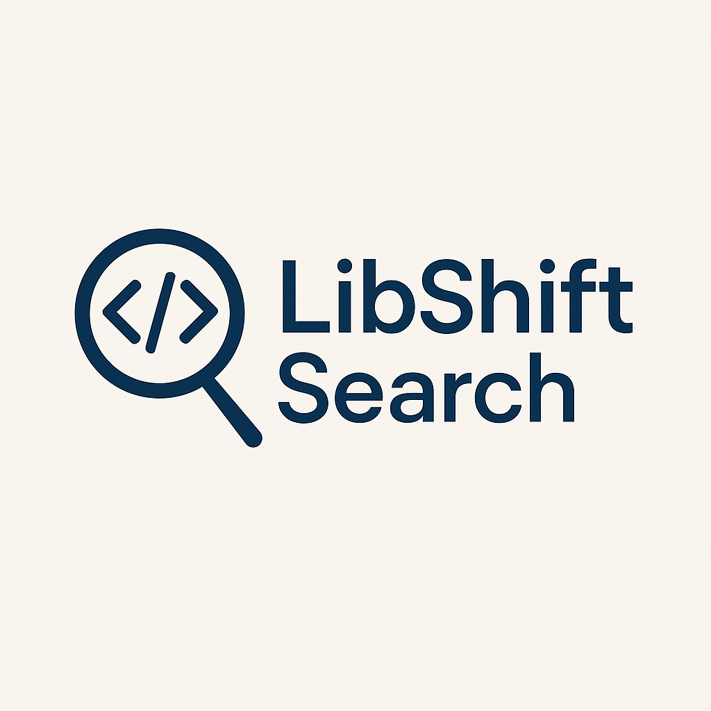

# libshift-search

Code generation is emerging as a promising application of Large Language Models (LLMs), with recent versions of open-sourced
and Close-sourced models demonstrating impressive capabilities in generating functional and syntactically correct code. However,
these models often reflect outdated usage patterns and frequently recommend deprecated APIs, a limitation rooted in their training
data’s static and historical nature. This gap between model-generated code and current best practices presents a significant challenge
for applying LLMs in real-world software development and maintenance, where libraries evolve quickly, and correctness relies on
accurate, version-specific APIs. In this paper, we model method-level API evolution as a semantic retrieval problem and propose
a framework to recover replacements for deprecated methods using multi-modal embeddings. We introduce LibShift Search, a
model-agnostic system that leverages code, name, and docstring embeddings to retrieve semantically equivalent methods from
newer library versions, evaluated on 96 deprecated methods across six widely used Python libraries Pandas, Pydantic, PyTorch,
NumPy, SciPy, and SQLAlchemy. LibShift Search achieves over 71% Top-7 accuracy using only code embeddings. Our results
underscore the effectiveness of the Embedding models, trained with contrastive triplet loss, in capturing structural and behavioral
similarities even without docstrings or explicit deprecation metadata. To support this framework, we also introduce the LibShift
Database. This version-aware knowledge base tracks Python libraries across releases by recording all methods, classes, and files and
their implementations. The database enables models to verify the existence and validity of APIs and dependencies they generate,
bridging the gap between generative systems and evolving software ecosystems.

